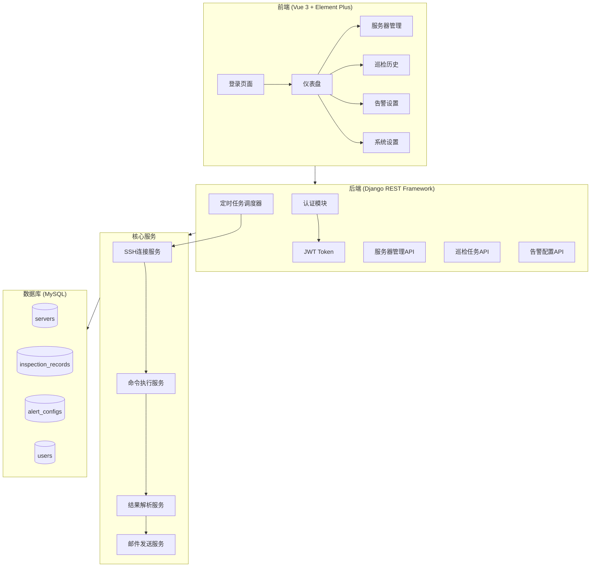
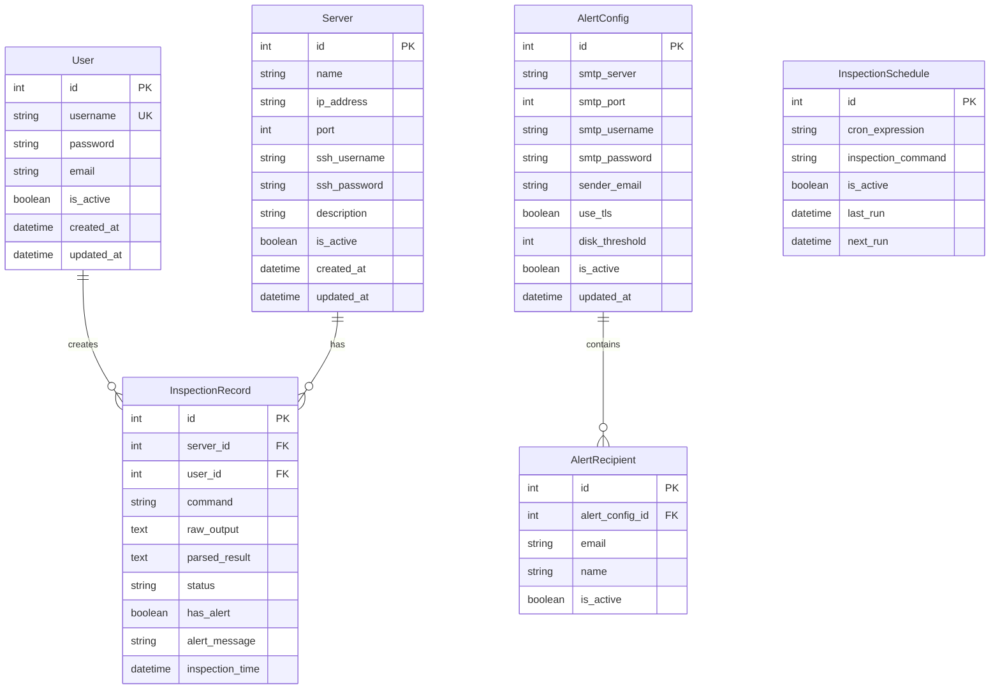

# 服务器硬盘自动巡检平台 - 项目设计文档

## 1. 系统架构



## 2. ER 图



## 3. 接口清单

### 3.1 认证模块 (AuthController)

| Method | Endpoint            | Description      |
| ------ | ------------------- | ---------------- |
| POST   | /api/auth/login/    | 用户登录         |
| POST   | /api/auth/logout/   | 用户登出         |
| GET    | /api/auth/profile/  | 获取当前用户信息 |
| PUT    | /api/auth/password/ | 修改密码         |

### 3.2 服务器管理 (ServerController)

| Method | Endpoint                | Description    |
| ------ | ----------------------- | -------------- |
| GET    | /api/servers/           | 获取服务器列表 |
| POST   | /api/servers/           | 添加服务器     |
| GET    | /api/servers/{id}/      | 获取服务器详情 |
| PUT    | /api/servers/{id}/      | 更新服务器信息 |
| DELETE | /api/servers/{id}/      | 删除服务器     |
| POST   | /api/servers/{id}/test/ | 测试SSH连接    |

### 3.3 巡检管理 (InspectionController)

| Method | Endpoint                  | Description      |
| ------ | ------------------------- | ---------------- |
| GET    | /api/inspections/         | 获取巡检记录列表 |
| POST   | /api/inspections/execute/ | 手动执行巡检     |
| GET    | /api/inspections/{id}/    | 获取巡检详情     |
| DELETE | /api/inspections/{id}/    | 删除巡检记录     |

### 3.4 告警配置 (AlertController)

| Method | Endpoint                     | Description    |
| ------ | ---------------------------- | -------------- |
| GET    | /api/alerts/config/          | 获取告警配置   |
| PUT    | /api/alerts/config/          | 更新告警配置   |
| POST   | /api/alerts/test/            | 发送测试邮件   |
| GET    | /api/alerts/recipients/      | 获取收件人列表 |
| POST   | /api/alerts/recipients/      | 添加收件人     |
| DELETE | /api/alerts/recipients/{id}/ | 删除收件人     |

### 3.5 调度配置 (ScheduleController)

| Method | Endpoint               | Description  |
| ------ | ---------------------- | ------------ |
| GET    | /api/schedule/         | 获取调度配置 |
| PUT    | /api/schedule/         | 更新调度配置 |
| POST   | /api/schedule/run-now/ | 立即执行巡检 |

## 4. UI/UX 规范

### 4.1 色彩系统

- 主色调: `#409EFF` (Element Plus 默认蓝)
- 成功色: `#67C23A`
- 警告色: `#E6A23C`
- 危险色: `#F56C6C`
- 信息色: `#909399`
- 背景色: `#F5F7FA`
- 卡片背景: `#FFFFFF`

### 4.2 字体规范

- 主字体: `-apple-system, BlinkMacSystemFont, 'Segoe UI', Roboto, 'Helvetica Neue', Arial`
- 标题字号: 20px / 18px / 16px
- 正文字号: 14px
- 辅助文字: 12px

### 4.3 间距规范

- 页面边距: 24px
- 卡片间距: 16px
- 元素间距: 8px / 12px / 16px

### 4.4 圆角规范

- 卡片圆角: 8px
- 按钮圆角: 4px
- 输入框圆角: 4px

## 5. 目录结构

```
label-00309/
├── backend/                    # Django 后端
│   ├── config/                 # 项目配置
│   ├── apps/
│   │   ├── users/             # 用户认证
│   │   ├── servers/           # 服务器管理
│   │   ├── inspections/       # 巡检管理
│   │   ├── alerts/            # 告警配置
│   │   └── schedules/         # 调度配置
│   ├── services/              # 业务服务
│   ├── utils/                 # 工具类
│   ├── Dockerfile
│   ├── requirements.txt
│   └── manage.py
├── frontend-admin/            # Vue 3 管理后台
│   ├── src/
│   │   ├── api/
│   │   ├── components/
│   │   ├── views/
│   │   ├── stores/
│   │   ├── router/
│   │   └── styles/
│   ├── Dockerfile
│   └── package.json
├── docker-compose.yml
├── .gitignore
├── .prettierignore
└── README.md
```
